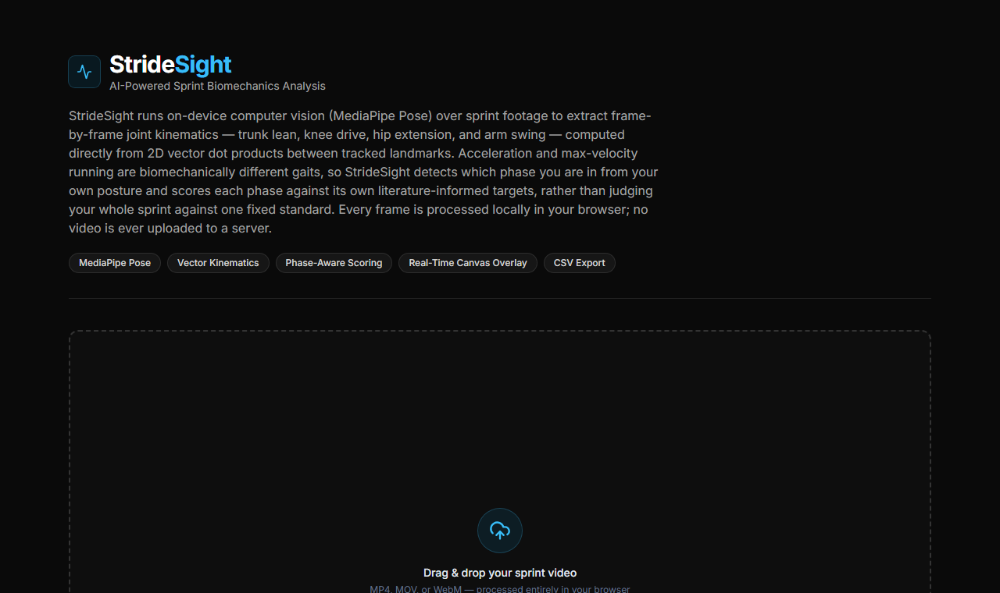

# StrideSight

AI-powered, on-device sprint biomechanics analysis — no video ever leaves the browser.



## What it does

Upload a sprint video (MP4, MOV, or WebM) and StrideSight runs Google's MediaPipe Pose model entirely client-side to extract frame-by-frame joint kinematics — trunk lean, knee drive, hip extension, and arm swing — via vector dot products between tracked landmarks. Knee drive, hip extension, and arm swing are computed in real-world **3D** (MediaPipe's `poseWorldLandmarks`, metric coordinates), which removes the foreshortening a flat 2D projection introduces whenever a limb moves toward or away from the camera. Trunk lean stays a deliberate **2D** image-plane measurement — see [How the biomechanics engine works](#how-the-biomechanics-engine-works) for why 3D doesn't actually solve that one.

On top of the continuous per-frame angles, StrideSight detects discrete **gait events** — ground contact and toe-off, per leg — from the same landmark stream, with no force plate or extra hardware. That unlocks four more metrics: knee extension at toe-off, over-stride distance, ground contact time, and flight time.

The core idea: acceleration and max-velocity sprinting are biomechanically different gaits, not the same gait done "better" or "worse." A sprinter's forward trunk lean — the signal sports science literature uses to distinguish these phases — is tracked in real time and used to classify every frame into **Acceleration**, **Transition**, or **Max Velocity**. Each phase is then scored against its own literature-informed targets, rather than judging an entire sprint against one fixed standard.

## Features

- **3D joint angles** — knee drive, hip extension, and arm swing are computed from MediaPipe's real-world 3D landmarks (meters, hip-centered), not flat 2D pixel positions, so a limb swinging toward or away from the camera doesn't foreshorten the measured angle.
- **Gait event detection** — ground contact and toe-off, detected per leg from causal local-peak detection on ankle height (2D) and knee-extension angle (3D), with no force plate. Feeds knee extension at toe-off, over-stride distance, ground contact time, and flight time, each gated behind a minimum detected-stride count before being shown.
- **Phase-aware scoring** — separate 0–100 form scores per detected sprint phase, each grounded in phase-specific biomechanical targets (see [Research grounding](#research-grounding)).
- **Real-time skeleton + joint-angle overlay** — a canvas layer draws the tracked skeleton and semi-transparent arcs at each measured joint, color-coded to how that angle compares to the current phase's targets.
- **Coaching feedback, not just numbers** — specific, numbers-backed recommendations *and* strengths ("What's Working"), a highlighted top-priority focus area, and a synthesized cross-phase narrative summary.
- **Cadence** — causal peak-detection on the knee-drive signal estimates steps per minute, reported as context rather than graded — published research shows elite sprinters are legitimately frequency-reliant *or* length-reliant, so there's no single "correct" cadence to impose.
- **Symmetry checks** — flags persistent left/right gaps in arm swing or knee drive that can indicate a strength imbalance or compensation pattern.
- **Manual phase override** — auto-detection reads trunk lean and needs a roughly side-on camera angle; an override lets you force a phase if your footage makes auto-detection unreliable.
- **CSV export** — full frame-by-frame data plus per-phase summary blocks (scores, recommendations, strengths), ready for external analysis.
- **100% client-side** — video is decoded and analyzed frame-by-frame in the browser and never uploaded anywhere.

## Tech stack

- **Next.js 14** (App Router) + **TypeScript**
- **Tailwind CSS**
- **MediaPipe Pose** (dynamically imported client-side — see [Architecture notes](#architecture-notes))
- **lucide-react** for icons

## Getting started

```bash
git clone https://github.com/alexandrio1710/stridesight.git
cd stridesight
npm install
npm run dev
```

Open [http://localhost:3000](http://localhost:3000) and drop in a sprint video.

## Project structure

```
app/
  layout.tsx         Root layout
  page.tsx           Landing page / header
  globals.css        Tailwind entrypoint
components/
  VideoAnalyzer.tsx  Client component: video/canvas, MediaPipe lifecycle, dashboard UI
utils/
  biomechanics.ts    Pure math/scoring engine — no DOM, no React, fully unit-testable
```

`utils/biomechanics.ts` is deliberately framework-agnostic: vector math, phase classification, continuous scoring, and recommendation/strength generation all live there as pure functions operating on plain data, independent of MediaPipe or React.

## How the biomechanics engine works

1. **Landmark → angle, in 3D where it counts.** Every tracked angle is computed via the same vector dot-product identity, `cos(θ) = (BA · BC) / (|BA| |BC|)`, extended to three dimensions. Knee drive, hip extension, and arm swing use MediaPipe's `poseWorldLandmarks` (real-world meters, hip-centered) — these are angles *between body segments*, and a 2D image-plane projection foreshortens them whenever the limb's plane of motion isn't exactly perpendicular to the camera. Trunk lean is different: it's measured *against true vertical*, and neither Google's docs nor the MediaPipe source specify whether the world-landmark axes are gravity-aligned or merely camera-relative — it's a pure vision model with no gravity sensor. Guessing that axis convention wrong would silently invert every trunk-lean reading, so trunk lean deliberately stays a 2D image-plane calculation instead, where "down" is an unambiguous, documented convention (the image y-axis).
2. **Phase classification.** Trunk lean is smoothed with an exponential moving average and classified into a sprint phase using a Schmitt-trigger-style hysteresis band, so the detected phase doesn't flicker if lean is hovering near a boundary.
3. **Phase-specific thresholds.** Each phase has its own optimal/caution bands per metric — e.g. max-velocity's hip-extension target is intentionally *less* extreme than acceleration's, because published research shows elite sprinters terminate ground contact before reaching full extension at top speed, favoring fast leg recovery over maximal extension.
4. **Continuous scoring.** A 0–100 score per metric is derived from the same threshold constants used for the live 3-color status, via a continuous piecewise-linear mapping (not a discontinuous step).
5. **Recommendations & strengths.** Every metric below its optimal threshold generates a specific, numbers-backed recommendation; every metric that clears it generates an equally specific strength callout. A cross-phase narrative then synthesizes across all reliably-scored phases into a short coaching summary.

## Research grounding

Phase-specific thresholds are synthesized from published sprint biomechanics literature, not invented numbers or a trained model — MediaPipe's pose detector is the only pretrained model in this pipeline; everything downstream is a rules-based coaching heuristic:

- [Transition from upright to greater forward-lean posture predicts faster acceleration](https://www.sciencedirect.com/science/article/pii/S0966636223013085)
- [Sprint start biomechanics](https://auptimo.com/sprint-start-biomechanics/)
- [Kinematic stride characteristics of maximal sprint running of elite sprinters](https://pmc.ncbi.nlm.nih.gov/articles/PMC8008308/)
- [Angular kinematics during top-speed sprinting](https://www.ncbi.nlm.nih.gov/pmc/articles/PMC11994691/)
- [Sprint mechanics: phases, technique, and speed cues](https://thecompleteathleteguide.com/sprint-mechanics/)
- [Biomechanics of sprint running (overview)](https://en.wikipedia.org/wiki/Biomechanics_of_sprint_running)
- [Ground contact time in sprinting (elite ~80-100ms at max velocity)](https://simplifaster.com/articles/coyne-ground-contact-time/)
- [Ground contact time detection with inertial sensors in elite 100m sprints](https://www.ncbi.nlm.nih.gov/pmc/articles/PMC8587724/)
- [Elite sprinting: step-frequency vs. step-length reliance](https://www.researchgate.net/publication/47566908_Elite_Sprinting_Are_Athletes_Individually_Step-Frequency_or_Step-Length_Reliant)
- [Sprinter cadence data (elite ~260-300 steps/min)](https://bigredrunning.com/2024/07/13/cadence-part-2-sprinters/)

## Limitations

- **Camera angle still matters for trunk lean.** It's the one metric that stays 2D on purpose (see above), so it's only meaningful from a roughly side-on, level camera. Head-on, behind-the-runner, or tilted footage will give unreliable phase classification; use the manual override in that case. Knee drive, hip extension, and arm swing are more robust to camera angle now that they're computed in 3D, but MediaPipe's 3D pose estimate is itself only as good as what the model can infer from a single 2D video — it's not stereo vision or a depth sensor.
- **These are coaching heuristics, not individual prescriptions.** Elite sprinters vary meaningfully in technique by body type, event, and training background. Scores are a conversation-starter, not a verdict — cadence in particular is reported without a "correct" number, since research shows elite sprinters are legitimately frequency-reliant or length-reliant.
- **No absolute running speed.** `poseWorldLandmarks` are metric (meters), which is enough for over-stride distance (a body-relative gap, not an absolute position) and ground contact/flight time (pure video-timestamp durations, no spatial scale needed at all) — but there's no camera calibration step, so real-world running speed or distance covered still can't be measured.
- **Gait events are vision-estimated, not force-plate-verified.** Ground contact is inferred from a local maximum in ankle height and toe-off from the following local maximum in knee extension — well-precedented proxies in markerless sprint analysis, but proxies nonetheless. Very fast or slow effective frame-processing rates (device-dependent, since MediaPipe's WASM inference speed varies by hardware) can occasionally pair non-adjacent frames as if consecutive; StrideSight rejects samples outside a physiologically plausible range for this reason rather than reporting them as real data, but a rejected sample means less data, not a corrected one.

## Architecture notes

- `@mediapipe/pose` touches `window`/`self` at module-evaluation time, which breaks Next.js's server-side render pass if statically imported — even inside a `'use client'` component. It's loaded via a dynamic `import()` inside a `useEffect` instead, guaranteeing it only ever executes client-side.
- Every analyzed frame carries two parallel landmark arrays with identical 33-point indexing: `poseLandmarks` (2D, image-plane) and `poseWorldLandmarks` (3D, real-world meters). `computeFrameMetrics()` takes both and routes each metric to whichever one is actually correct for it, rather than picking one coordinate space for everything.
